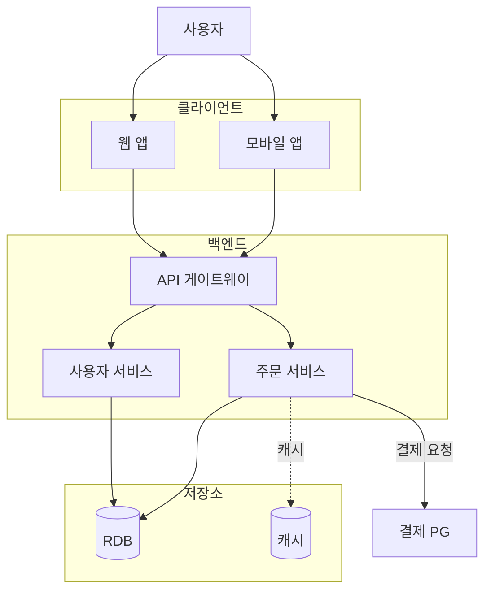
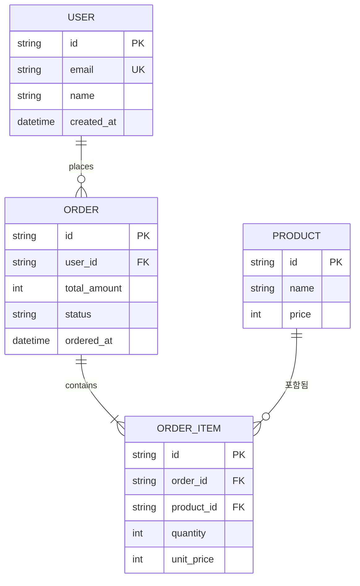
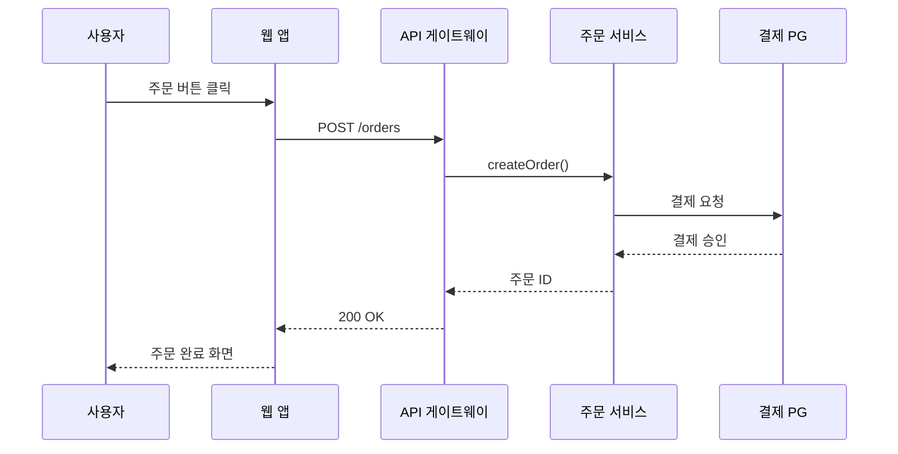

# Mermaid Syntax Cheatsheet — cto-architect 전용

Mermaid 문법은 사소한 실수 하나로 전체 다이어그램이 렌더링되지 않는다. 이 파일은 cto-architect가 자주 그리는 4종 다이어그램(`graph TD/LR`, `erDiagram`, `sequenceDiagram`, `flowchart`)에서 **흔히 깨지는 패턴**과 **안전한 작성 방식**만 모았다. 그리기 전에 한 번 훑으면 거의 모든 렌더 실패를 막을 수 있다.

---

## 공통 룰 (모든 다이어그램에 적용)

1. **노드 ID는 영문 소문자 + 숫자만**. 한글·공백·하이픈·점 금지. ID에 한글이 들어가면 일부 다이어그램은 렌더되지 않거나 어색해진다.
   - 안전: `userSvc`, `apiGw`, `db1`, `orderQueue`
   - 위험: `사용자`, `api-gw`, `user.service`

2. **라벨에 한글·공백·특수문자가 들어가면 따옴표로 감싼다**.
   - `userSvc["사용자 서비스 (User)"]`
   - 괄호 `()`, 콜론 `:`, 따옴표 등 특수문자는 항상 `["..."]` 안에 둔다.

3. **예약어는 ID로 쓰지 않는다**: `end`, `class`, `default`, `subgraph`, `style`, `link`, `click`. 특히 `end`는 흔히 실수한다. (`endpoint`로 바꿔 쓰자.)

4. **ID 중복 금지**. 다이어그램 전체에서 ID는 유일해야 한다. 같은 이름의 박스를 두 번 그리고 싶다면 ID는 다르게, 라벨만 같게.

5. **화살표 문법은 정확히**:
   - 실선: `-->`  (대시 두 개 + `>`)
   - 점선: `-.->`
   - 굵은선: `==>`
   - 라벨 있는 실선: `-->|라벨|`  또는  `-- 라벨 -->`
   - 짧은 화살표 `->`는 시퀀스 다이어그램에서만, 플로우차트에서는 동작하지 않는다.

6. **다이어그램은 mermaid 코드 블록 안에 한 종류만**. `graph TD`와 `erDiagram`을 한 블록에 섞으면 깨진다.

---

## 1. `graph TD` / `graph LR` — 시스템 컴포넌트 다이어그램

cto-architect의 핵심 다이어그램. 컴포넌트, 외부 의존성, 통신 방향을 표시한다.

### 안전한 골격

### 도형 어휘

| 도형 | 문법 | 용도 |
|------|------|------|
| 사각형 | `id["라벨"]` | 일반 서비스/모듈 |
| 둥근 사각형 | `id("라벨")` | 부드러운 컴포넌트 표시 |
| 원통 (DB) | `id[("라벨")]` | **저장소 (RDB, 캐시, 오브젝트 스토리지)** |
| 원 | `id(("라벨"))` | 사용자/액터 |
| 마름모 | `id{"라벨"}` | 분기/결정 노드 |
| 육각형 | `id{{"라벨"}}` | 외부 시스템 |

### 흔한 함정

- ❌ `subgraph backend` ... `end` 의 `end`를 노드 ID로 또 쓰는 경우 → 무조건 깨짐
- ❌ `client → web` 처럼 유니코드 화살표 → 동작 안 함, 반드시 `-->`
- ❌ 같은 라벨이라도 ID 다르게: `db1[("주문 RDB")]`, `db2[("결제 RDB")]`
- ❌ `subgraph` 라벨에 공백·한글이면 따옴표 필요: `subgraph backend["백엔드"]`

---

## 2. `erDiagram` — 데이터 모델 ERD

### 안전한 골격

### 카디널리티 기호 (반드시 정확히)

| 의미 | 기호 |
|------|------|
| 정확히 하나 | `||` |
| 0 또는 하나 | `|o` |
| 하나 이상 | `}|` |
| 0개 이상 | `}o` |

조합 예시:
- `USER ||--o{ ORDER` → 사용자 한 명이 0개 이상의 주문을 가진다 (1:N)
- `ORDER ||--|{ ORDER_ITEM` → 주문은 1개 이상의 아이템을 가진다 (1:N, N≥1)
- `USER }o--o{ ROLE` → 사용자와 역할은 N:M

### 흔한 함정

- ❌ 엔티티 이름은 **대문자 권장**: `USER`, `ORDER`, `ORDER_ITEM`. 소문자도 되지만 일관성을 위해 대문자.
- ❌ 속성 라인에 한글 컬럼명을 그대로 쓰면 일부 환경에서 깨진다. 영문 식별자 + 한글은 관계 라벨 또는 별도 표에.
- ❌ 관계 라벨에 한글·공백이면 따옴표: `: "포함됨"`. 영문 단어 하나면 따옴표 생략 가능: `: places`.
- ❌ PK/FK/UK 표기는 속성 뒤에 띄어쓰기로: `string id PK`, `string user_id FK`
- ❌ `--` 화살표 양옆에 공백을 빼먹지 말 것: `USER ||--o{ ORDER` (O), `USER||--o{ORDER` (X)

---

## 3. `sequenceDiagram` — 핵심 플로우 (선택)

cto-architect는 보통 시퀀스 다이어그램을 그리지 않지만, "핵심 사용자 흐름"을 보여줄 때 유용.

### 함정

- `participant X as 라벨`에서 라벨에 공백·한글이 들어가도 따옴표 없이 동작한다 (`as` 이후는 줄 끝까지가 라벨).
- 메시지 화살표는 `->>`(실선), `-->>`(점선, 응답).
- 짧은 `->`는 메시지 화살표가 아니라 단순 화살표라서 의미가 다르다.

---

## 4. `flowchart` (= `graph`의 신문법)

`graph TD`와 `flowchart TD`는 거의 같지만, `flowchart`가 신문법이고 일부 기능(서브그래프 방향 제어 등)이 더 강력하다. cto-architect는 호환성을 위해 `graph TD`를 기본으로 쓴다.

---

## 렌더 실패 디버그 체크리스트

다이어그램을 생성한 뒤 다음을 빠르게 점검한다:

- [ ] 모든 노드 ID가 영문 소문자+숫자뿐인가
- [ ] 한글·공백 들어간 라벨이 모두 `["..."]`로 감싸졌는가
- [ ] `end`, `class`, `default` 같은 예약어를 ID로 쓰지 않았는가
- [ ] ID 중복은 없는가
- [ ] 화살표가 모두 `-->` / `-.->` / `==>` 중 하나인가 (유니코드·짧은 `->` 금지)
- [ ] `subgraph` 마다 `end`가 짝맞춰 닫혔는가
- [ ] erDiagram: 카디널리티 기호가 정확한가 (`||--o{` 등)
- [ ] erDiagram: 한 엔티티 블록 안에서 속성 한 줄당 `타입 이름 [PK/FK/UK]` 형식인가
- [ ] 한 mermaid 블록에 한 종류의 다이어그램만 들어있는가

이 체크리스트만 지나가도 렌더 실패의 90%는 잡힌다.
